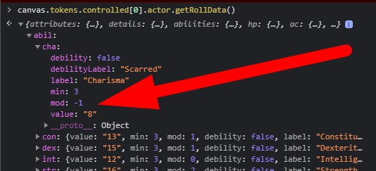

# Very Simple Macros for Talespire
Very simple macros and instrutions to send dice rolls to Talespire.

You can read the journal Instructions for more information.

# Basics
To send a roll to Talespire just put this code in the browser.
```
talespire://dice/1d20
```
To call it from Foundry VTT use shis macro
```
window.open(`talespire://dice/1d20`};
```

# Dice Options
You can use modifiers:
```
talespire://dice/1d20+3
talespire://dice/1d20-3+1d4
```
You can create more than one group]
```
talespire://dice/2d20+3/1d6+4
```

# Named Dice URLs
You can describe the roll.
```
talespire://dice/Fireball:8d6
talespire://dice/Sword:1d6+1
talespire://dice/Huge%20Sword:1d6+1
```


# Token Data
You can easily get data from an actor. 
Open the console (F12) and paste these lines:
```
const actor = game.actors.getName("My Character Name");
console.log(actor.getRollData());
```
An alternative is to select a token and
```
canvas.tokens.controlled[0].actor.getRollData()
```
or
```
canvas.tokens.controlled[0].actor
```
Find out what you need. 
<p align="center">
  
</p>

Then you can do something like this:
```
const roll = `2d6+${canvas.tokens.controlled[0].actor.getRollData().abil.str.mod}`;
const message = 'My Strength' ; 
window.open(`talespire://dice/${message}:${roll}`);
```

You can add the name of the token to the roll
```
const roll = `2d6+${canvas.tokens.controlled[0].actor.getRollData().abil.str.mod}`;
const message = `${canvas.tokens.controlled[0].actor.name}` ; 
```

# Instalation
You can use this link to install: https://raw.githubusercontent.com/brunocalado/rpgnextcriticos/main/module.json

# Mudanças
You can read about changes at [CHANGELOG](CHANGELOG.md)

